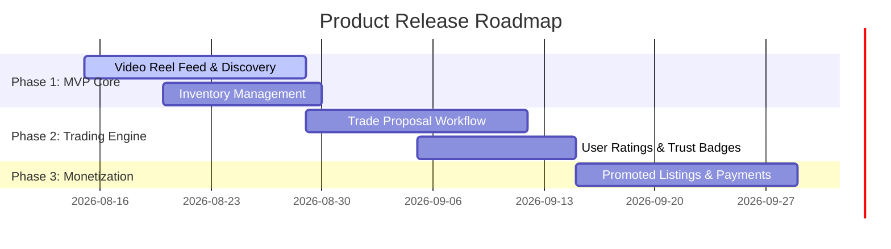

# 🗺️ Product Roadmap & Strategic Epics
**Role Owner**: Product Owner / CPO  
**Sync Target**: Business Owner Goals $\rightarrow$ Tech Architect Execution  

---

## 🚀 Epic Breakdown

### Epic 1: Interactive Video Reel Discovery (MVP)
- **Goal**: Enable vertical video feeds of available toys with like/share/swap actions.
- **Key Features**: Auto-playing video feed, interactive gesture controls, sound toggle, tag filters (Age, Category, Condition).

### Epic 2: Toy Exchange & Proposal Engine
- **Goal**: Seamless peer-to-peer exchange workflow.
- **Key Features**: "Propose Trade" modal, item selector from user's inventory, trade acceptance/counter-offer state machine, chat integration.

### Epic 3: User Verification & Safety Trust Badge
- **Goal**: Build parental trust and reduce scam listings.
- **Key Features**: Phone/Email verification, location proximity filter, user rating system, report/flag mechanism.

### Epic 4: Monetization & Promoted Feed
- **Goal**: Monetize high-visibility listings.
- **Key Features**: "Feature My Toy" payment flow via Stripe/Google Pay, analytics dashboard for sellers.

---

## 🗓️ Release Timeline

