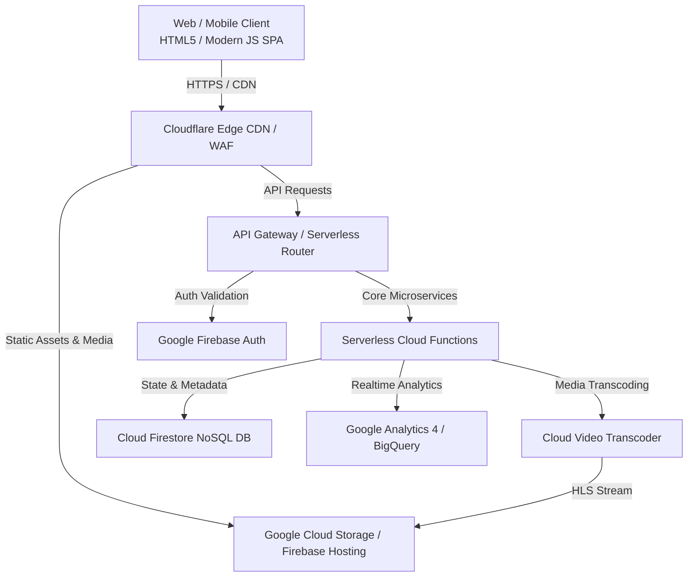

# 🏗️ System Architecture & Engineering Blueprint
**Role Owner**: Tech Architect / CTO  
**System Target**: Production-Ready, Scalable, Low-Latency Web/Mobile Platform  

---

## 📐 Enterprise System Architecture Blueprint

---

## 🛠️ Technology Stack Specification

| Component | Selected Technology | Rationale & Enterprise Standards |
| :--- | :--- | :--- |
| **Frontend UI** | HTML5, Modern Modular JS, Vanilla CSS / CSS Variables | Zero bloat, instant startup time, maximum cross-device support. |
| **Asset Bundler** | Vite | Lightning-fast HMR and optimized production asset slicing. |
| **Backend & APIs** | Node.js Serverless Functions / Firebase Functions | Automatic scaling, zero server management, sub-100ms cold starts. |
| **Database** | Google Cloud Firestore | Document-oriented, real-time sync, offline support, auto-scaling. |
| **Media Delivery** | Google Cloud Storage + Cloudflare CDN | Global low-latency video streaming, cost-effective bandwidth. |
| **Authentication** | Firebase Auth (OAuth2, Phone, Email/Pass) | Enterprise-grade JWT management, multi-factor support. |
