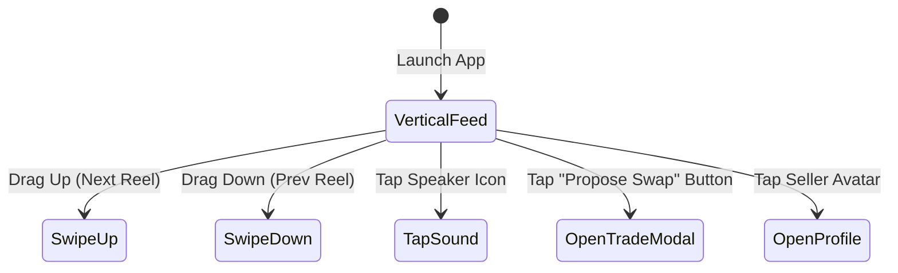

# 📱 User Experience Flows & Wireframe Specifications
**Role Owner**: UI/UX Designer  

---

## 📲 Flow 1: Reel Discovery & Swipe Navigation

---

## 🤝 Flow 2: Toy Swap Proposal Wireframe Flow

1. **Step 1: Reel Viewer Screen**
   - Floating overlay on right side: Like Heart, Swap Icon, Share Arrow, Bookmark.
   - Bottom Overlay: Toy Title, Condition Tag, Seller Badge ("Verified Parent"), Distance ("2.4 miles away").
   - Primary Call-To-Action (CTA): **"Propose Swap"** (Vivid Gradient Button).

2. **Step 2: Swap Selector Sheet (Bottom Modal)**
   - Header: "Select Toy from Your Collection to Offer"
   - Grid of user's active toys with checkboxes.
   - Cash Top-up Slider: `+$0` to `+$50`.
   - Message Input: "Add a friendly message..."
   - CTA: **"Send Proposal"**.

3. **Step 3: Confirmation Dialog**
   - Micro-animation: Animated party popper / trade icon.
   - Message: "Proposal Sent to [Seller Name]! We'll notify you when they respond."
