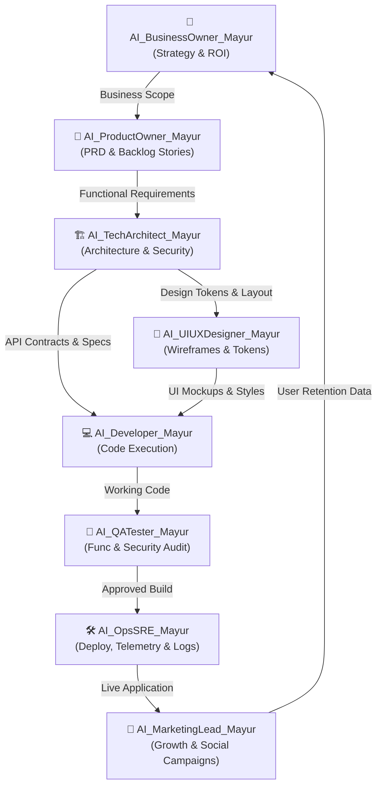

# 🏢 Enterprise Organization & Role Sync Hub
**Project**: Toy Promote & Exchange Platform  
**Agile Framework**: Jira / Kanban Visual Command Center  
**Architecture Version**: 2.0.0 Parallel Enterprise  

---

## 📌 Executive Summary

This repository operates as a real-world Agile software enterprise. Each department is powered by dedicated AI Personas tagged with your name (`AI_*_Mayur`). You can prompt any role agent directly to perform parallel micro-level execution or view active progress on the visual **Jira-Style Agile Command Center**.

---

## ⚡ Interactive Jira Visual Agile Board

Open the built-in visual Agile Command Center in your browser to view active sprints, swimlanes, and tickets assigned to your persona agents:

👉 **[Launch Interactive Visual Jira/Agile Board](file:///Users/mayurnemade/Toy_PromoteAndExhange/company/agile_dashboard/index.html)**

---

## 🤖 Dedicated AI Persona Agents & Role Mapping

Each role is an active, defined AI Persona with explicit domain authority and folder responsibilities:

| AI Persona Name | Department & Role | Folder Workspace | Key Responsibilities | Recommended Model |
| :--- | :--- | :--- | :--- | :--- |
| **`AI_BusinessOwner_Mayur`** | Business Owner / CEO | `company/01_business_owner/` | ROI, business strategy, P&L, monetization levers, strategic OKRs. | **Gemini 3.6 Pro** |
| **`AI_ProductOwner_Mayur`** | Product Owner / CPO | `company/02_product_owner/` | PRDs, Epics, user stories, backlog prioritization, Gherkin criteria. | **Gemini 3.6 Flash** |
| **`AI_TechArchitect_Mayur`** | Tech Architect / CTO | `company/03_tech_architect/` | Microservices topology, NFRs, security hardening, latencies, API contracts. | **Gemini 3.6 Pro** |
| **`AI_UIUXDesigner_Mayur`** | Lead UI/UX Designer | `company/04_design_ui_ux/` | Design system tokens, glassmorphism CSS, wireframes, user flows. | **Gemini 3.6 Flash** |
| **`AI_Developer_Mayur`** | Lead Full-Stack Dev | `company/05_development/` & `src/` | Code implementation, API integration, refactoring, unit tests. | **Gemini 3.6 Flash** |
| **`AI_QATester_Mayur`** | QA Lead & Security Audit | `company/06_qa_testing/` | Functional testing, edge cases, load tests, OWASP security audit. | **Gemini 3.6 Flash / Pro** |
| **`AI_MarketingLead_Mayur`** | CMO & Growth Lead | `company/07_marketing/` | Viral Instagram/TikTok reels, acquisition funnel, SEO, content calendar. | **Gemini 3.6 Flash** |
| **`AI_OpsSRE_Mayur`** | Operations / SRE | `company/08_operations/` | App telemetry, uptime monitoring, alert rules, CI/CD, post-mortems. | **Gemini 3.6 Flash-Lite** |
| **`AI_LegalCompliance_Mayur`** | Legal & Compliance | `company/09_legal_compliance/` | COPPA child safety, data privacy (GDPR/CCPA), terms of service. | **Gemini 3.6 Pro** |

---

## 💬 Direct Persona Invocation & Parallel Execution Protocols

You can direct tasks to any specific persona agent in chat or invoke multiple agents in parallel for rapid micro-execution:

### Example Direct Prompts:
- **Product Owner Task**:  
  `"AI_ProductOwner_Mayur, create a detailed user story for user rating and trust badges."`
- **Tech Architect Task**:  
  `"AI_TechArchitect_Mayur, design the Firestore security rules and API endpoint for trade proposals."`
- **Developer Task**:  
  `"AI_Developer_Mayur, implement the trade proposal modal component in src/."`
- **QA Security Audit Task**:  
  `"AI_QATester_Mayur, run an OWASP input sanitization audit on all input fields."`
- **Parallel Multi-Role Prompt**:  
  `"AI_ProductOwner_Mayur define story US-005, while AI_UIUXDesigner_Mayur designs the wireframe and AI_Developer_Mayur prepares the component template concurrently."`

---

## 🔄 Inter-Role Execution Loop (Agile Kanban Flow)

---

## ⚡ Quick Nav Links to Departmental Workspaces

- 📊 **[Interactive Jira Agile Board App](file:///Users/mayurnemade/Toy_PromoteAndExhange/company/agile_dashboard/index.html)**
- 💼 [AI_BusinessOwner_Mayur Workspace](file:///Users/mayurnemade/Toy_PromoteAndExhange/company/01_business_owner/business_strategy.md)
- 📝 [AI_ProductOwner_Mayur Workspace](file:///Users/mayurnemade/Toy_PromoteAndExhange/company/02_product_owner/product_backlog.md)
- 🏗️ [AI_TechArchitect_Mayur Workspace](file:///Users/mayurnemade/Toy_PromoteAndExhange/company/03_tech_architect/system_architecture.md)
- 🎨 [AI_UIUXDesigner_Mayur Workspace](file:///Users/mayurnemade/Toy_PromoteAndExhange/company/04_design_ui_ux/design_system.md)
- 💻 [AI_Developer_Mayur Workspace](file:///Users/mayurnemade/Toy_PromoteAndExhange/company/05_development/dev_guidelines.md)
- 🧪 [AI_QATester_Mayur Workspace](file:///Users/mayurnemade/Toy_PromoteAndExhange/company/06_qa_testing/qa_strategy.md)
- 📣 [AI_MarketingLead_Mayur Workspace](file:///Users/mayurnemade/Toy_PromoteAndExhange/company/07_marketing/marketing_strategy.md)
- 🛠️ [AI_OpsSRE_Mayur Workspace](file:///Users/mayurnemade/Toy_PromoteAndExhange/company/08_operations/ops_monitoring_setup.md)
- ⚖️ [AI_LegalCompliance_Mayur Workspace](file:///Users/mayurnemade/Toy_PromoteAndExhange/company/09_legal_compliance/privacy_and_compliance.md)
- 📊 [Google Workspace Sync Guide](file:///Users/mayurnemade/Toy_PromoteAndExhange/company/tools_and_integrations/google_workspace_sync_guide.md)
- 🤖 [AI Model Token Optimization Matrix](file:///Users/mayurnemade/Toy_PromoteAndExhange/company/tools_and_integrations/ai_model_allocation_matrix.md)
