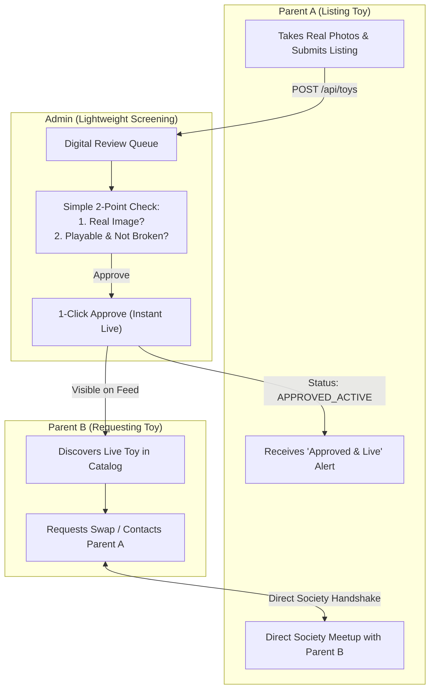
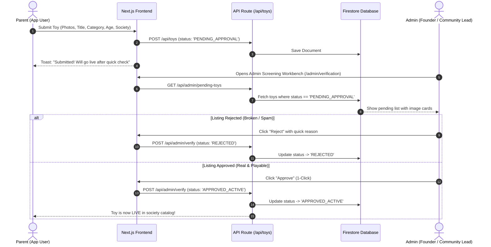
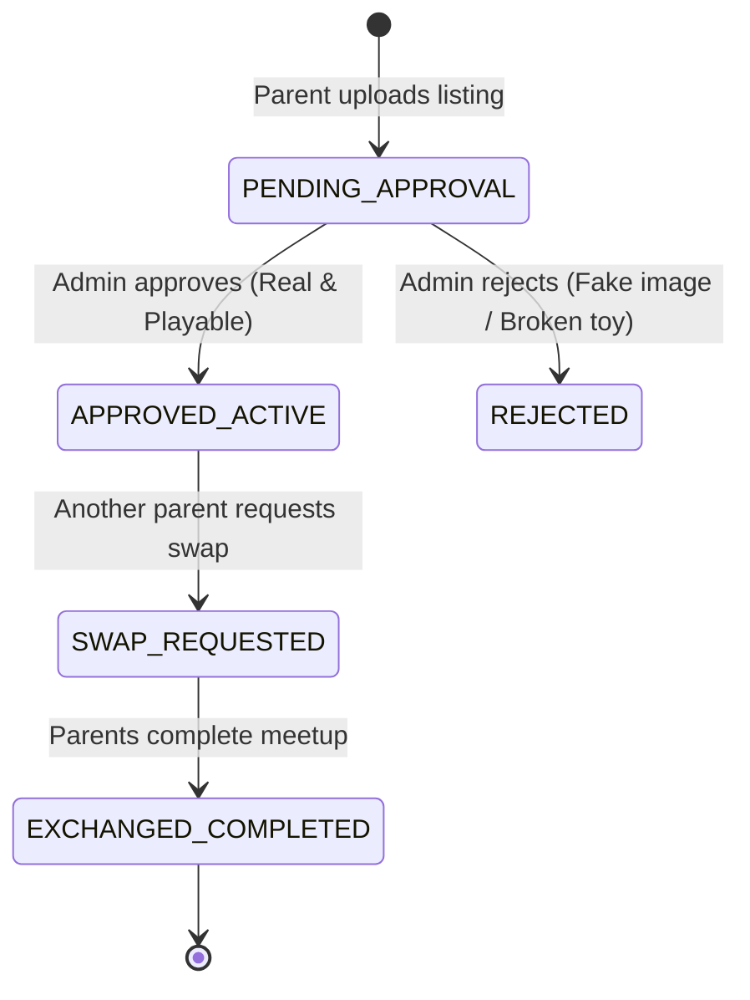

# 📐 High-Level Design (HLD): Lean Community User Flow & Lightweight Admin Verification

**Project:** Toy Promote & Exchange (`Toy_PromoteAndExhange`)  
**Document Type:** Technical Architecture & System Flow Specification (Lean MVP Focus)  
**Persona Author:** `AI_TechArchitect_Mayur`  
**Story Reference:** `STORY-MSX8Y3M8`  
**Approach:** Phase 1 Lean P2P Community Model (Zero Physical Overhead)

---

## 1. Executive Summary & Pragmatic MVP Vision

For the initial launch in Ravet/Pune societies, the platform operates on a **Community Trust & Direct Parent-to-Parent (P2P) Handshake Model**. 

Because there is no dedicated operations/sanitization team in the early phase, the verification process is intentionally **ultra-lightweight and 100% digital**, handled directly by the admin/founder via a quick screening console.

### Core Principles for Phase 1:
1. **Trusted Neighborhood Parents:** Direct exchange between parents within housing societies (e.g., *Celestial City, Rohan Ananta, Urban Skyline*).
2. **Lean Digital Screening:** Admin checks only 2 basic criteria:
   - **Authenticity:** Is the image real (not a stock photo / spam / inappropriate)?
   - **Playability:** Is the toy in safe, playable condition (not visibly broken or hazardous)?
3. **Direct Society Handshake:** Once digitally approved, toys go live immediately. Parents coordinate handover directly at the society clubhouse or lobby.



---

## 2. Personas & Capabilities (Lean MVP)

| Attribute | Persona 1: App User (Parent) | Persona 2: Admin (Lightweight Screener) |
| :--- | :--- | :--- |
| **Primary Goal** | Declutter outgrown toys, find new ones affordably | Ensure feed quality and prevent broken/fake listings |
| **Effort / Overhead** | 2-minute mobile upload (1–3 photos + title + society) | 10-second visual review per submission |
| **Review Criteria** | N/A | 1. Is the image real?<br>2. Is the toy playable & safe? |
| **Logistics** | Direct neighbor-to-neighbor meetup at society gate/clubhouse | Zero physical handling or storage required |

---

## 3. Streamlined End-to-End Sequence Diagram



---

## 4. Simplified State Machine



---

## 5. Lean Data Architecture (Firestore)

### `toys` Collection Document Schema:
```typescript
interface ToyListing {
  id: string;                      // Generated ID (e.g., "toy-101")
  ownerId: string;                 // User ID
  ownerName: string;               // e.g., "Mayur Nemade"
  societyName: string;             // e.g., "Celestial City, Ravet"
  
  // Basic content
  title: string;                   // e.g., "Wooden Rainbow Stacker"
  description: string;             // e.g., "In good condition, complete pieces"
  category: string;                // "STEM", "Wooden", "Vehicles", etc.
  ageRange: string;                // "0-2 Yrs", "3-5 Yrs", "6-8 Yrs"
  images: string[];                // Real photos uploaded by parent
  points?: number;                 // Suggested exchange points (optional)
  
  // Lightweight Verification Status
  status: 'PENDING_APPROVAL' | 'APPROVED_ACTIVE' | 'REJECTED' | 'EXCHANGED';
  
  adminReview?: {
    reviewedAt?: string;
    isRealImage: boolean;          // Quick toggle
    isPlayableCondition: boolean;  // Quick toggle
    rejectionReason?: string;      // Optional note if rejected
  };

  createdAt: string;
  updatedAt: string;
}
```

---

## 6. Admin Screening Workbench UI Specification

A minimalistic, lightning-fast admin console for zero-friction approvals:

```
+-----------------------------------------------------------------------------------+
|  🧸 OJAS TOY EXCHANGE — ADMIN SCREENING CONSOLE               [5 Pending Reviews] |
+-----------------------------------------------------------------------------------+
|                                                                                   |
|  [ Card #1: LEGO Duplo Steam Train ]                                              |
|  Society: Celestial City, Ravet  |  Posted by: Priya Sharma (2 hrs ago)           |
|                                                                                   |
|  +---------------------------+   Quick Checks:                                    |
|  |                           |   [x] Real Photo (Not stock/spam)                  |
|  |     [ TOY PHOTO HERE ]    |   [x] Playable & Complete (Not visibly broken)     |
|  |                           |                                                    |
|  +---------------------------+   Actions:                                         |
|  Description: "Complete set, works perfectly"                                     |
|                                  [ ❌ Reject ]         [ ✅ Approve & Go Live ]    |
+-----------------------------------------------------------------------------------+
```

---

## 7. Evolution Path: Phase 1 (Now) vs Phase 2 (Future Scale)

```
┌────────────────────────────────────────────────────────┐
│ PHASE 1: LEAN COMMUNITY PILOT (CURRENT)                │
│ • Direct Parent-to-Parent society exchanges            │
│ • 10-second digital screening (Real photo + Playable)  │
│ • Zero warehouse, zero staff, zero logistics cost      │
│ • High trust within gated Ravet communities            │
└────────────────────────────────────────────────────────┘
                           │
                           ▼ (Once profitable & venture-backed)
┌────────────────────────────────────────────────────────┐
│ PHASE 2: MANAGED SERVICE (FUTURE EXPANSION)            │
│ • Central physical hub & UV-C disinfection chamber     │
│ • Certified hygiene seal & tamper-proof bags           │
│ • Runner pickup & delivery between distant societies   │
│ • Subscription monetization (PlayPass)                 │
└────────────────────────────────────────────────────────┘
```

---

*Updated Architecture Blueprint committed by Persona `AI_TechArchitect_Mayur`.*
