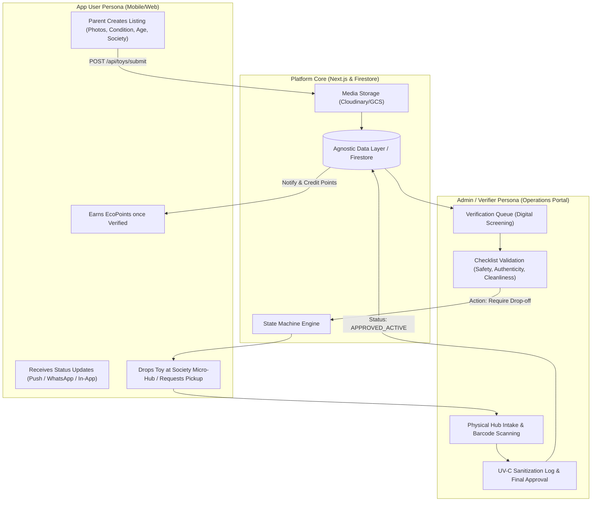
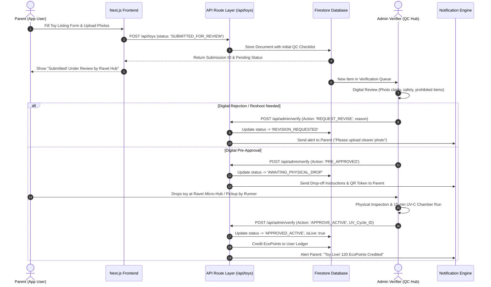
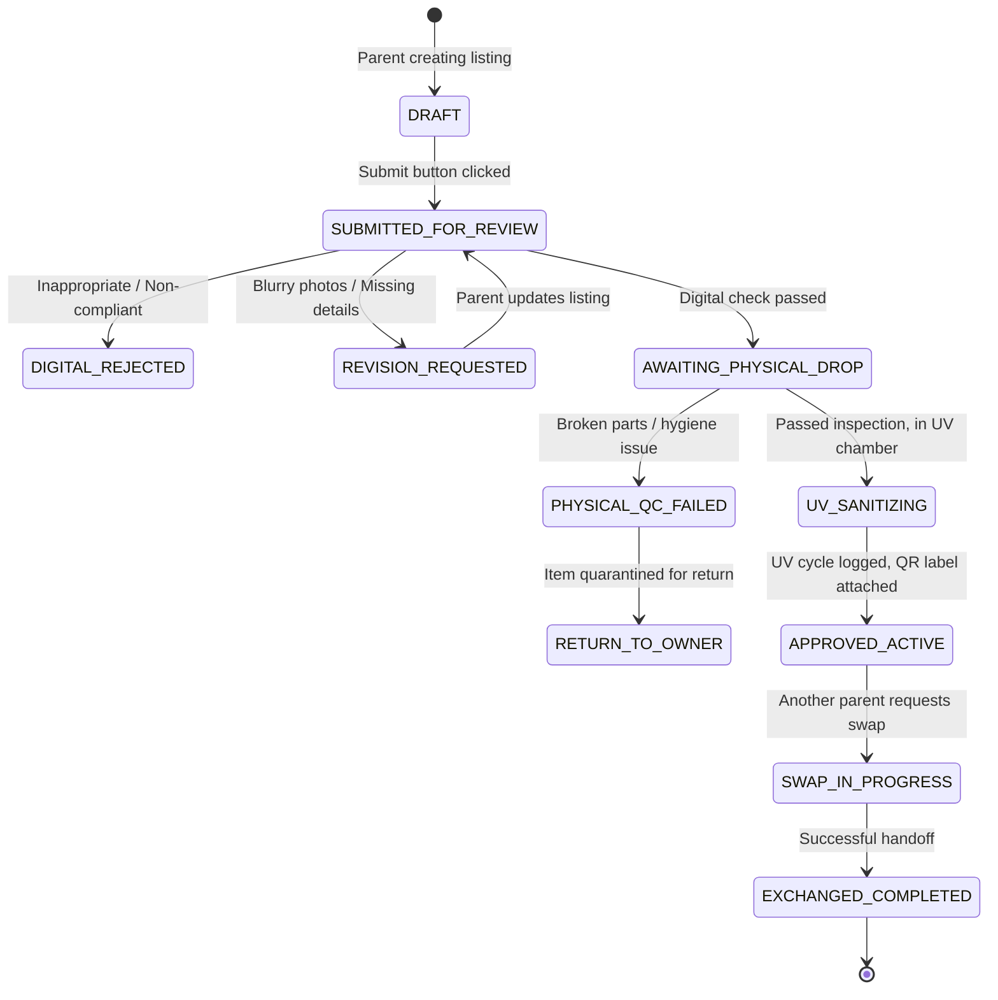

# 📐 High-Level Design (HLD): End-to-End User Flow & Admin Verification Architecture

**Project:** Toy Promote & Exchange (`Toy_PromoteAndExhange`)  
**Document Type:** Technical Architecture & System Flow Specification  
**Persona Author:** `AI_TechArchitect_Mayur`  
**Story Reference:** `STORY-MSX8Y3M8`  
**Status:** Approved Architectural Blueprint  

---

## 1. Executive Architecture Summary

This document establishes the **High-Level Design (HLD)** and **End-to-End User & Verification Flows** for the Toy Exchange Platform. 

The core design centers around two primary user personas:
1. **App User (Parent / Community Member):** Discovers toys, creates listings for outgrown toys, requests swaps, and earns `EcoPoints`.
2. **Admin / Hub Verifier (Operations & QC Manager):** Reviews digital submissions, performs physical inspection, verifies hygiene/UV-C sanitization, and authorizes catalog publication.



---

## 2. Persona Specifications & Capabilities

| Attribute | Persona 1: App User (Parent) | Persona 2: Admin Verifier (Operations/QC) |
| :--- | :--- | :--- |
| **Primary Interface** | Responsive Web / Mobile PWA (`apps/frontend`) | Dedicated Admin Console (`/admin` or `apps/admin`) |
| **Authentication** | Mobile OTP / NextAuth (Parents 18+) | Role-Based MFA / Admin IAM (`role: 'ADMIN_VERIFIER'`) |
| **Core Responsibilities** | Listing toys, requesting swaps, tracking drop-offs | Screening submissions, physical safety check, UV audit |
| **Key Actions** | - Upload photos & description<br>- Select society & pickup preference<br>- Request exchange & redeem points | - Approve / Reject / Request Reshoot<br>- Assign Safety Tag (ISI, Montessori, Sanitized)<br>- Log UV-C cycle ID & generate QR seal |
| **Permissions** | Read catalog, create/edit own items, manage own trades | Read all queues, update toy status, override listings, view audit trail |

---

## 3. End-to-End Sequence Diagram: Submission to Verification



---

## 4. Lifecycle State Machine for Toy Listings



---

## 5. Data Architecture & Schema Design

### 5.1 `users` Collection
```typescript
interface UserProfile {
  id: string;                      // Firebase Auth UID
  displayName: string;
  email: string;
  phoneNumber: string;
  societyName: string;            // e.g., "Celestial City, Ravet"
  flatNumber?: string;            // Encrypted, private until swap confirmed
  role: 'USER' | 'ADMIN_VERIFIER' | 'SUPER_ADMIN';
  ecoPointsBalance: number;
  isParentVerified: boolean;      // DPDPA adult consent
  createdAt: string;
  lastActive: string;
}
```

### 5.2 `toys` (and `toy_submissions`) Collection
```typescript
interface ToyListing {
  id: string;
  ownerId: string;
  ownerName: string;
  societyName: string;
  
  // Content details
  title: string;
  description: string;
  category: 'STEM' | 'Montessori' | 'Puzzles' | 'Vehicles' | 'PretendPlay' | 'Infant';
  ageRange: '0-2' | '3-5' | '6-8' | '9-12';
  condition: 'Brand New' | 'Like New' | 'Gently Used' | 'Well Loved';
  images: string[];
  suggestedPoints: number;
  
  // Verification & QC Lifecycle
  status: 
    | 'DRAFT'
    | 'SUBMITTED_FOR_REVIEW'
    | 'REVISION_REQUESTED'
    | 'AWAITING_PHYSICAL_DROP'
    | 'UV_SANITIZING'
    | 'APPROVED_ACTIVE'
    | 'REJECTED'
    | 'EXCHANGED_COMPLETED';

  verificationMetadata?: {
    verifiedByAdminId?: string;
    verifiedAt?: string;
    digitalChecklist: {
      hasOriginalParts: boolean;
      noSharpEdges: boolean;
      cleanAndIntact: boolean;
      appropriateMedia: boolean;
    };
    uvSanitizationCycleId?: string;
    qrSealCode?: string;
    rejectionReason?: string;
    internalNotes?: string;
  };

  createdAt: string;
  updatedAt: string;
}
```

### 5.3 `verification_audit_logs` Collection
```typescript
interface VerificationAuditLog {
  id: string;
  toyId: string;
  verifierId: string;
  verifierName: string;
  action: 'DIGITAL_APPROVE' | 'REJECT' | 'REQUEST_REVISION' | 'LOG_UV_SANITIZATION' | 'FINAL_PUBLISH';
  timestamp: string;
  comments: string;
  metadata: Record<string, any>;
}
```

---

## 6. Admin Verifier Portal UI Layout & Functional Specs

The Admin portal (`/admin/verification`) provides operations staff with a high-speed verification workbench:

```
+-----------------------------------------------------------------------------------+
|  OJAS TOY EXCHANGE - ADMIN OPERATIONS HUB (Ravet Central Hub)     [Role: Verifier] |
+-----------------------------------------------------------------------------------+
|  [Tabs: (12) Pending Digital | (4) Awaiting Physical Drop | (8) In UV-C | (120) Live] |
+-----------------------------------------------------------------------------------+
|  Queue Item #TOY-8921                                                             |
|  Title: "LEGO Duplo Deluxe Train Set"        Society: Celestial City, Ravet       |
|  Submitted by: Priya Sharma (4 successful swaps)  Points: 120 EcoPoints          |
+---------------------------------------------------+-------------------------------+
|  PHOTOS / VIDEO PREVIEW:                          |  VERIFICATION CHECKLIST:      |
|  [ Image 1 ]  [ Image 2 ]  [ Image 3 ]            |  [x] High Resolution Photos   |
|                                                   |  [x] No child faces in photos |
|  DESCRIPTION:                                     |  [x] Genuine brand / ISI Mark |
|  "Complete 59-piece set with motor..."            |  [x] All critical pieces pres.|
|                                                   |                               |
|                                                   |  SAFETY & HYGIENE GRADE:      |
|                                                   |  (o) Grade A (Like New)       |
|                                                   |  ( ) Grade B (Minor wear)     |
+---------------------------------------------------+-------------------------------+
|  ACTIONS:                                                                         |
|  [ ❌ Reject with Note ]   [ 🔄 Request Reshoot ]   [ ✅ Approve & Issue Drop QR ] |
+-----------------------------------------------------------------------------------+
```

---

## 7. Security, Authorization (RBAC) & Governance

1. **Server-Side Validation:** Admin routes (`/api/admin/*`) enforce Firebase Admin claims verification:
   ```typescript
   if (token.role !== 'ADMIN_VERIFIER' && token.role !== 'SUPER_ADMIN') {
     return NextResponse.json({ error: 'Unauthorized. Verifier role required.' }, { status: 403 });
   }
   ```
2. **Firestore Security Rules Matrix:**
   * **`toys` Collection:** Users can write only documents where `request.auth.uid == resource.data.ownerId` and `status == 'SUBMITTED_FOR_REVIEW'`. Only users with `auth.token.role == 'ADMIN_VERIFIER'` can transition `status` to `APPROVED_ACTIVE`.
3. **Immutable Audit Trail:** All state changes trigger an append-only write to `verification_audit_logs` preventing tamper or falsification of hygiene certifications.

---

## 8. Summary of Technical Deliverables

- [x] High-Level Design document created in [`docs/architecture/high_level_design_user_flow.md`](file:///Users/mayurnemade/Toy_PromoteAndExhange/docs/architecture/high_level_design_user_flow.md)
- [x] Mermaid sequence diagram & state machine lifecycle completed
- [x] Two-persona model defined with RBAC and schema integration
- [x] Ready for implementation in Next.js App Router and Firestore

*Document prepared by Persona `AI_TechArchitect_Mayur`.*
