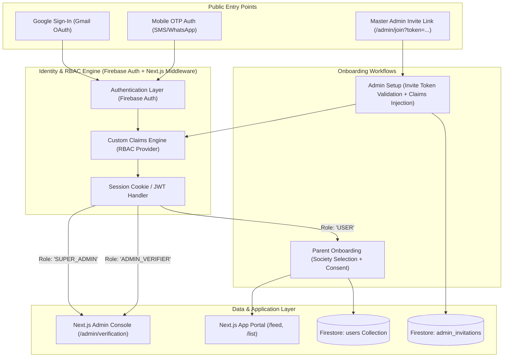
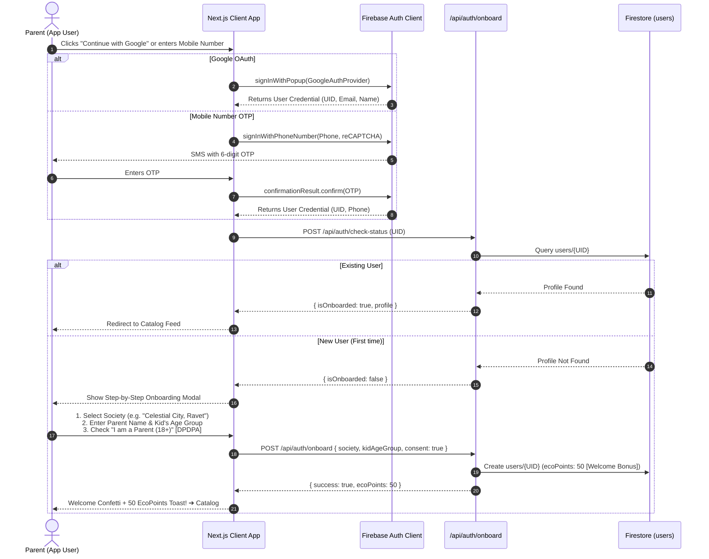
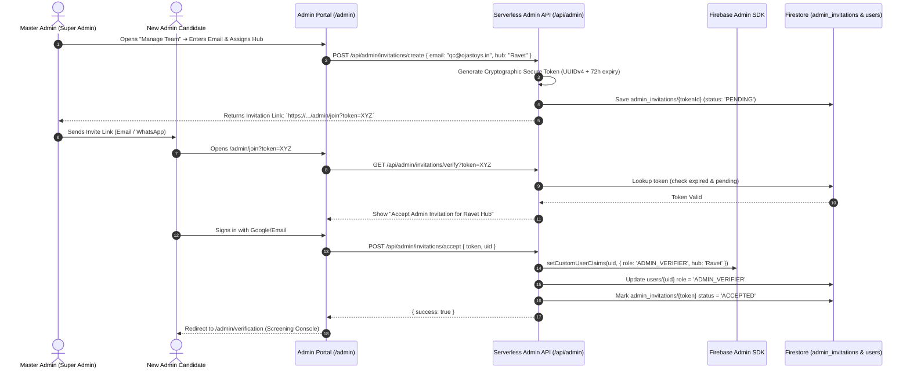

# 🔐 Technical Architecture & Design: User & Admin Onboarding & Authentication Journey

**Project:** Toy Promote & Exchange (`Toy_PromoteAndExhange`)  
**Document Type:** High-Level Design (HLD) & Low-Level Design (LLD)  
**Story ID:** `STORY-MSXCP87G`  
**Persona:** `AI_TechArchitect_Mayur`  
**Status:** Approved Technical Architecture  

---

## 1. Executive Overview & System Architecture

This architecture specifies the complete authentication and onboarding lifecycle for two distinct user hierarchies:
1. **App Users (Parents / Community Members):** Frictionless social login (Google OAuth) or Mobile OTP authentication, followed by localized society onboarding (*Ravet, Pune*) and DPDPA-compliant adult verification.
2. **Administrative Users (Hub Verifiers & Operations):** An invitation-only RBAC (Role-Based Access Control) system managed exclusively by a **Master Admin (Super Admin)**.



---

## 2. High-Level Design (HLD)

### 2.1 User Hierarchy & Roles Matrix

```
                      ┌───────────────────────────┐
                      │   SUPER_ADMIN (Master)    │
                      │  • Full system control    │
                      │  • Invite / Revoke Admins │
                      │  • Audit trail access     │
                      └─────────────┬─────────────┘
                                    │ Invites via Token
                                    ▼
                      ┌───────────────────────────┐
                      │  ADMIN_VERIFIER (Hub QC)  │
                      │  • Screen toy submissions │
                      │  • 2-point check approvals│
                      │  • Manage society queues  │
                      └───────────────────────────┘
                                    
  ┌──────────────────────────────────────────────────────────────────┐
  │                        APP_USER (Parents)                        │
  │ • Google Login / Mobile OTP   • Select Society (e.g. Ravet)     │
  │ • Upload listings             • Request swaps & earn EcoPoints   │
  └──────────────────────────────────────────────────────────────────┘
```

| Role | Auth Provider | Provisioning Method | Allowed Route Prefixes | Custom Claims Object |
| :--- | :--- | :--- | :--- | :--- |
| **`USER`** | Google OAuth / Phone OTP | Self-signup via app | `/`, `/explore`, `/list-toy`, `/api/toys` | `{ role: 'USER' }` |
| **`ADMIN_VERIFIER`** | Google OAuth / Email Magic Link | Master Admin Invite only | `/admin/verification`, `/admin/toys`, `/api/admin/*` | `{ role: 'ADMIN_VERIFIER', hubId: 'ravet-central' }` |
| **`SUPER_ADMIN`** | Secure Corporate Google / Pre-seeded | Initial deployment bootstrap / Secret Key | `/admin/*`, `/api/admin/*`, `/api/super-admin/*` | `{ role: 'SUPER_ADMIN' }` |

---

## 3. End-to-End User Journeys (Sequence Diagrams)

### 3.1 App User Journey: Sign-in & Society Onboarding



---

### 3.2 Admin Onboarding Journey: Master Admin Invitation & Claim Activation



---

## 4. Low-Level Design (LLD): Data Models & API Specifications

### 4.1 Firestore Document Schemas

#### Collection: `users`
```typescript
interface UserDocument {
  id: string;                         // Firebase Auth UID
  displayName: string;                // "Priya Sharma"
  email: string | null;               // "priya@gmail.com"
  phoneNumber: string | null;         // "+919876543210"
  role: 'USER' | 'ADMIN_VERIFIER' | 'SUPER_ADMIN';
  
  // Onboarding metadata
  societyId: string;                  // "ravet-celestial-city"
  societyName: string;                // "Celestial City, Ravet"
  flatNumber?: string;                // Optional, encrypted / private
  childrenAgeGroups?: string[];       // ['0-2', '3-5']
  
  // Compliance & Economy
  dpdpaConsent: {
    isAdultParent: boolean;
    consentedAt: string;
    ipAddress?: string;
  };
  ecoPointsBalance: number;           // e.g. 50 (Initial welcome credit)
  
  // Verification capability (for Admins only)
  adminMetadata?: {
    invitedBy: string;                // Super Admin UID
    assignedHub: string;              // "Ravet Central Hub"
    activatedAt: string;
  };

  createdAt: string;
  updatedAt: string;
}
```

#### Collection: `admin_invitations`
```typescript
interface AdminInvitationDocument {
  id: string;                         // Unique token (e.g., UUIDv4)
  email: string;                      // Invitee's designated email
  role: 'ADMIN_VERIFIER';
  assignedHub: string;                // "Ravet Central"
  invitedBySuperAdminId: string;
  
  status: 'PENDING' | 'ACCEPTED' | 'REVOKED' | 'EXPIRED';
  expiresAt: string;                  // ISO timestamp (now + 72 hours)
  acceptedByUid?: string;
  acceptedAt?: string;
  createdAt: string;
}
```

---

### 4.2 Next.js Route Protection Middleware

```typescript
// middleware.ts (Next.js Edge Middleware)
import { NextResponse } from 'next/server';
import type { NextRequest } from 'next/request';

export async function middleware(req: NextRequest) {
  const path = req.nextUrl.pathname;
  const token = req.cookies.get('__session')?.value;

  // 1. Protect Admin Routes
  if (path.startsWith('/admin') && !path.startsWith('/admin/join')) {
    if (!token) {
      return NextResponse.redirect(new URL('/auth/login?redirect=' + path, req.url));
    }
    
    // Server-side JWT decode or Firebase Admin claim validation
    const userRole = req.headers.get('x-user-role'); 
    if (userRole !== 'ADMIN_VERIFIER' && userRole !== 'SUPER_ADMIN') {
      return NextResponse.redirect(new URL('/403-unauthorized', req.url));
    }
  }

  return NextResponse.next();
}

export const config = {
  matcher: ['/admin/:path*', '/list-toy/:path*'],
};
```

---

## 5. Security Architecture & Edge-Case Handling

| Threat / Edge Case | Architectural Mitigation |
| :--- | :--- |
| **Token Tampering / Self-Promoted Admin** | Role claims are **never** trusted from client requests. They are set exclusively server-side via `firebase-admin.auth().setCustomUserClaims()` after verifying the invitation token in Firestore. |
| **Expired / Reused Invite Links** | Invite tokens have a strict 72-hour TTL and use atomic Firestore transactions (`transaction.update()`) to guarantee single-use consumption. |
| **Revoking a Compromised Admin** | Super Admin triggers `setCustomUserClaims(uid, { role: 'USER' })` and updates `users/{uid}.role = 'USER'`, instantly invalidating access on the next token refresh or session check. |
| **Unverified Minors / Children Privacy (DPDPA)** | Signup enforces a mandatory adult parent self-declaration checkpoint. No sensitive child identifiers (full name, exact birthdates) are stored in the database. |
| **Duplicate Mobile / Google Accounts** | Firebase Auth Account Linking links Google and Mobile numbers under a single UID if verified by the user. |

---

## 6. Summary of Architectural Deliverables

1. **Dual Auth Providers:** Google OAuth (1-click Gmail) + Mobile Number OTP (SMS).
2. **Master Admin Invitation Engine:** Secure tokenized admin onboarding workflow with role claim injection.
3. **Neighborhood Onboarding Modal:** Ravet society selection, DPDPA parent consent, and automated 50 EcoPoints welcome credit.
4. **Data Isolation:** Complete TypeScript document schema for `users` and `admin_invitations`.

*Architecture designed & verified by Persona `AI_TechArchitect_Mayur`.*
