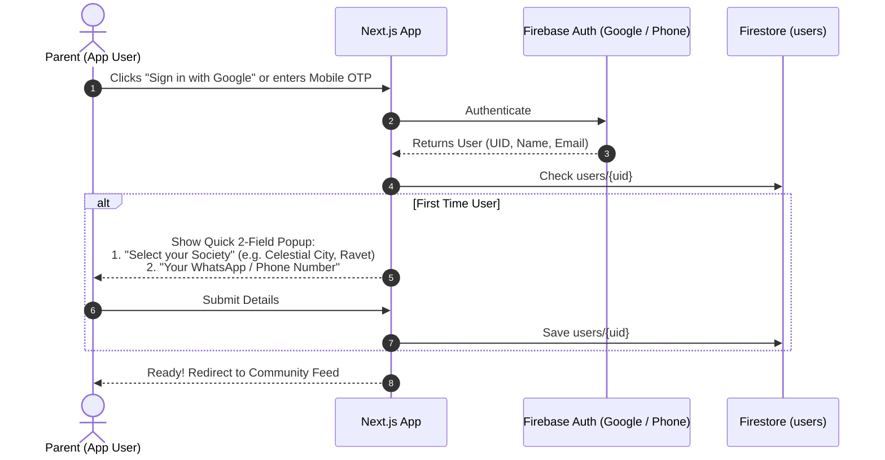

# 🧸 Lean MVP Architecture: OLX-Style P2P Toy Exchange & Minimalist Onboarding

**Project:** Toy Promote & Exchange (`Toy_PromoteAndExhange`)  
**Document Type:** Minimalist Technical Specification (Lean MVP Focus)  
**Story ID:** `STORY-MSXCP87G`  
**Persona:** `AI_TechArchitect_Mayur`  
**Core Model:** Hyper-local Peer-to-Peer (P2P) Direct Handover (OLX / Marketplace Model)

---

## 1. The Lean MVP Vision (Zero Operations Overhead)

For the MVP launch, the platform functions exactly like a **trusted, hyper-local OLX / Community Marketplace for toys**:
* **No Middlemen / No Hubs:** Exchanges happen 100% directly between parents in the same or nearby housing societies (e.g., *Celestial City, Rohan Ananta, Urban Skyline in Ravet*).
* **Direct In-Person Handover:** Parents connect on the platform and arrange a direct meetup at their society clubhouse, lobby, or gate.
* **Minimalist Auth:** 1-Click Google Sign-in or Mobile OTP.
* **Founder-Mode Admin:** No complex invite-token infrastructure. Admin access is controlled via a simple list of authorized admin emails in `.env`.

```mermaid
graph LR
    ParentA["Parent A (Lists Outgrown Toy)"] -->|1. Post Photo & Details| Feed["Community Toy Feed"]
    ParentB["Parent B (Finds Toy in Society)"] -->|2. Clicks 'Swap / Connect'| Contact["WhatsApp / In-App Handshake"]
    Contact <-->|3. In-Person Handover (Society Gate/Clubhouse)| ParentA
```

---

## 2. Ultra-Simple User & Admin Personas

```
┌────────────────────────────────────────────────────────┐
│                   PARENT (APP USER)                    │
│ • 1-Click Google Login or Phone OTP                    │
│ • Select Society (e.g., "Celestial City, Ravet")       │
│ • Post toys in 60 seconds (Photo + Title + Condition)  │
│ • Direct chat / WhatsApp meetup for handover           │
└────────────────────────────────────────────────────────┘

┌────────────────────────────────────────────────────────┐
│               FOUNDER / ADMIN (LIGHTWEIGHT)            │
│ • Admin check: Configured in ADMIN_EMAILS env variable │
│ • Simple dashboard: Delete spam / Inappropriate posts  │
│ • Zero complex invite flows or multi-tiered roles      │
└────────────────────────────────────────────────────────┘
```

---

## 3. Minimalist Onboarding Flow (Under 30 Seconds)



---

## 4. Minimalist Firestore Schema

### 4.1 `users` Collection
```typescript
interface UserProfile {
  id: string;                     // Firebase Auth UID
  name: string;                   // "Priya Sharma"
  email?: string;                 // "priya@gmail.com"
  phone?: string;                 // "+919876543210"
  societyName: string;            // "Celestial City, Ravet"
  createdAt: string;
}
```

### 4.2 `toys` Collection
```typescript
interface ToyItem {
  id: string;                     // Auto-generated ID
  ownerId: string;                // User UID
  ownerName: string;              // "Priya Sharma"
  societyName: string;            // "Celestial City, Ravet"
  
  title: string;                  // "LEGO Duplo Steam Train"
  description: string;            // "Complete set in great shape"
  category: string;               // "STEM", "Puzzles", "Vehicles"
  ageRange: string;               // "3-5 Yrs"
  image: string;                  // Photo URL
  
  status: 'available' | 'swapped';
  createdAt: string;
}
```

---

## 5. Direct In-Person Handover Flow (OLX Style)

1. **Discovery:** Parent B browses toys filtered by their society (e.g. *Ravet*).
2. **Connection:** Parent B clicks **"Swap / Contact Owner"** on a toy card.
3. **Handshake:**
   * Option A (Fastest): Opens a pre-filled **WhatsApp message**:  
     `"Hi Priya! I saw your LEGO Duplo listing on Ojas Toy Exchange. I live in Celestial City too, can we swap this weekend?"`
   * Option B: In-app swap ticket where Parent A clicks "Mark as Swapped" once handed over.
4. **Completion:** Toy status updates to `'swapped'` and leaves the active feed.

---

## 6. Lightweight Founder Admin Check

Instead of an elaborate invite-code system, admin rights are verified in one line:

```typescript
// lib/auth/admin.ts
const ADMIN_EMAILS = (process.env.ADMIN_EMAILS || '').split(',');

export function isUserAdmin(email?: string | null): boolean {
  if (!email) return false;
  return ADMIN_EMAILS.includes(email.trim().toLowerCase());
}
```

* When logged in with an admin email, an **"Admin Dashboard"** button appears in the navbar to moderate/delete flagged listings.

---

*Minimalist MVP Architecture locked by Persona `AI_TechArchitect_Mayur`.*
