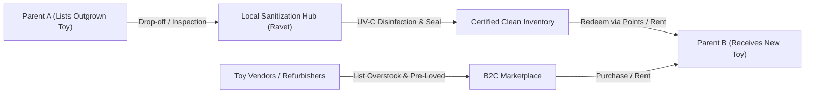
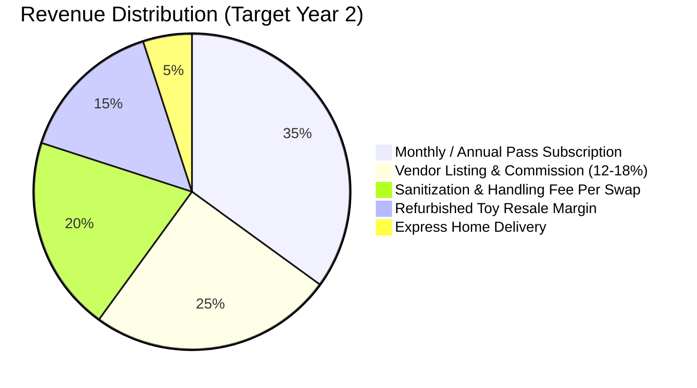
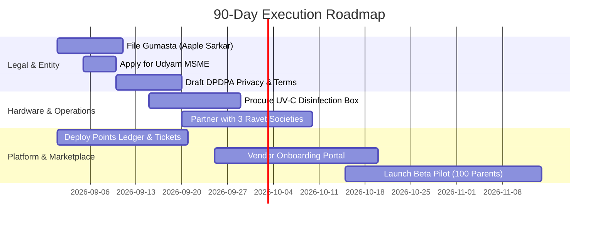

# 🧸 Toy Exchange & Vendor Marketplace: Business Operations & Legal Blueprint (Pune / PCMC)

**Document Type:** Business Architecture & Regulatory Blueprint  
**Market Focus:** Pune Metropolitan Region (Pimpri-Chinchwad Municipal Corporation - PCMC & PMC)  
**Target Area:** Ravet, Kiwale, Punawale, Wakad, Hinjawadi corridor  
**Business Model:** Hybrid Hyperlocal Toy Exchange (C2C Swap) + Certified Vendor Resale / Rental Marketplace (B2C)

---

## 1. Executive Summary & Core Value Proposition

Modern parenting faces a distinct dilemma: **rapid toy obsolescence**. Children outgrow toys within 3–6 months, leading to cluttered apartments, high recurring expenses for parents, and plastic waste. 

### The Solution: Circular Toy Economy
1. **Peer-to-Peer Toy Swaps (C2C):** Parents in residential societies exchange gently used toys using an automated points/token ledger (`EcoPoints`).
2. **Certified Pre-Loved & Overstock Resale (B2C):** Verified toy vendors, local creators (Montessori, wooden toys), and refurbished inventory sold with hygiene certification.
3. **Trust & Hygiene Assurance:** A 4-step UV-C disinfection and bio-sanitization standard that eliminates 99.9% of bacteria/pathogens before handoff.



---

## 2. Brand Identity & Company Naming Strategy

To enable future expansion beyond Pune while establishing hyper-local trust, the brand name must be catchy, memorable, emotionally resonant for parents, trademarkable under **Class 28 (Games/Toys)** & **Class 35 (Retail/E-commerce)**, and available for `.in` / `.com` domains.

### Evaluation Matrix

| Name Candidate | Meaning & Brand Resonance | Strengths | Risk / Considerations | Recommendation Rating |
| :--- | :--- | :--- | :--- | :--- |
| **KidoSwap** *(or Kidoswap)* | "Kids" + "Swap" / Community exchange | Simple, instant clarity, modern digital feel | Needs trademark clearance in Class 35 | ⭐⭐⭐⭐ (High) |
| **ToyCycle** | "Toy" + "Lifecycle / Circular Economy" | Strong eco-friendly message, appeals to millennial parents | Common term, domain might require prefix | ⭐⭐⭐⭐ (High) |
| **KhelMandali** | "Khel" (Play) + "Mandali" (Community in Marathi/Hindi) | Deep local Pune/Maharashtra cultural affinity, warm community feel | Harder for pan-India non-Hindi/Marathi scale | ⭐⭐⭐ (Great for local pilot) |
| **PlayLoop** | Continuous loop of playful discovery | Sleek, modern, tech-forward, scalable for subscriptions | Needs domain variation (e.g. `playloop.in`) | ⭐⭐⭐⭐⭐ **(Top Pick - Global & India)** |
| **ToyVarta** | "Toy" + "Varta" (Story / Conversation) | Emotional storytelling ("every toy has a story") | Slightly abstract for commercial e-commerce | ⭐⭐⭐ |
| **Ojas Toy Exchange** | "Ojas" (Vitality, strength, spark) | Currently in prototype; strong authentic local brand | Very personal; great initial trust in Ravet societies | ⭐⭐⭐⭐ **(Recommended for Pune Pilot)** |

> [!TIP]
> **Recommended Approach:** Launch the Pune pilot under **"Ojas PlayLoop"** or **"PlayLoop (Powered by Ojas)"** to retain grassroots neighborhood trust while creating a venture-scale brand identity.

---

## 3. Legal Entity & Business Establishment in Pune / PCMC

For operations in Pune (specifically the Ravet / PCMC corridor), the business should transition through two phases:

### Phase 1: Pilot & MVP Phase (First 6–12 Months)
* **Structure:** **Sole Proprietorship** or **Limited Liability Partnership (LLP)**.
* **Why:** Minimal initial compliance burden, fast registration, low incorporation costs (₹3,000–₹7,000).

### Phase 2: Commercial Scale & Vendor Marketplace (Post Seed / Expansion)
* **Structure:** **Private Limited Company (Pvt. Ltd.)** under the Companies Act, 2013.
* **Why:** Essential for onboarding third-party vendors, raising angel/venture funding, issuing ESOPs, and ring-fencing founder liability.

---

## 4. Regulatory, Compliance & Local Licensing Matrix

Operating a physical exchange + digital marketplace in PCMC/PMC requires compliance across labor, municipal, consumer, and tax laws.

| License / Compliance | Issuing Authority | Applicable Law | Threshold & Cost (Approx.) | Mandatory for MVP? |
| :--- | :--- | :--- | :--- | :--- |
| **Shop & Establishment Registration (Gumasta)** | PCMC / Aaple Sarkar Portal | Maharashtra Shops & Establishments Act, 2017 | Form F (Intimation for <10 staff) - Free/₹500. Form A (≥10 staff) | **Yes (Within 60 days of starting)** |
| **Marathi Signboard Compliance** | PCMC Municipal Inspectorate | Maharashtra S&E Amendment Act 2022 | Mandatory Devnagari font of equal or larger prominence | **Yes (Physical hubs/offices)** |
| **Udyam (MSME) Registration** | Ministry of MSME, Govt of India | MSMED Act, 2006 | Free (Online via Aadhaar) | **Yes (Provides bank subsidy & credit perks)** |
| **GST Registration** | State/Central GST Dept | CGST / SGST Act, 2017 | Mandatory if aggregate turnover > ₹40L (Goods) / ₹20L (Services), OR **mandatory for any e-commerce operator collecting TCS** | **Yes (Once vendor sales start)** |
| **BIS Toy Safety Standards (QCO)** | Bureau of Indian Standards | Toys (Quality Control) Order, 2020 | All new toys sold via vendors must carry ISI mark (IS 9873 / IS 15644) | **Yes (For vendor items)** |
| **Solid Waste & E-Waste Management Guidelines** | PCMC Health Dept / MPCB | E-Waste (Management) Rules, 2022 | Safe disposal protocols for electronic/battery-operated toys | **Recommended standard** |

---

## 5. Data Privacy & Child Safety (DPDPA 2023 Compliance)

Handling products for children creates sensitive privacy obligations under India's **Digital Personal Data Protection Act (DPDPA), 2023** and **DPDP Rules 2025**.

### Key Rules & Platform Architecture Requirements:
1. **Child Definition (<18 Years):** The platform **must not directly profile, track, or target advertise to minors**.
2. **Parent / Guardian Verifiable Consent:**
   - Account creation is restricted strictly to parents/guardians (Age 18+).
   - Require OTP validation (Aadhaar or Mobile linked to DigiLocker/e-KYC).
3. **No Direct Child Photos:** Listing guidelines must mandate that toy photos contain **only the toy**, prohibiting identifiable photos of children playing with the toy without explicit parental blur/consent.
4. **Society Privacy:** Society name can be public (e.g., *Celestial City, Ravet*), but exact flat numbers and phone numbers are hidden until a trade is confirmed.

---

## 6. Monetization Models & Revenue Architecture

A hybrid model balances free community adoption with high-margin services:



### 1. Per-Swap Handling & Sanitization Fee
* **Model:** ₹49 to ₹99 per confirmed exchange.
* **Covers:** UV-C sterilization, QR tamper-proof packaging, and hub operations.

### 2. "PlayPass" Community Membership (Subscription)
* **Tier 1 (Free / Pay-as-you-go):** ₹79 per swap, 1 active swap ticket at a time.
* **Tier 2 (Super Parent - ₹499/month):** Unlimited society swaps, zero sanitization fees, priority AI matchmaker, 2 free home pickups/month.
* **Tier 3 (Annual Eco-Pass - ₹3,999/year):** Includes 200 bonus EcoPoints, free seasonal sanitization kit, and certified return guarantee.

### 3. Vendor Marketplace Commission (B2C)
* **Model:** 12% – 18% take rate on sales from local toy vendors, artisan wooden toy makers, and educational kit sellers in Pune.

### 4. Certified Refurbished Toy Sales
* **Model:** Platform buys gently-used high-value items (LEGO, Hot Wheels tracks, balance bikes), inspects, deep-cleans, packages as "Certified Like-New", and resells at 40–50% margin.

---

## 7. Financial Modeling & Startup Capital Breakdown (PCMC Pilot)

### Capital Expenditure (CAPEX - One Time)
| Item | Description | Cost (INR) |
| :--- | :--- | :--- |
| **UV-C Sanitization Chamber** | Commercial UV-C box (300L capacity) + Ozone deodorizer | ₹35,000 |
| **Packaging & Heat Sealer** | Heavy-duty impulse sealer + bio-degradable sealed bags (2,000 pcs) | ₹12,000 |
| **Local Hub Signage (Bilingual)** | Marathi/English signage for society hub or home kiosk | ₹8,000 |
| **Legal & Licenses** | Gumasta registration, trademark filing (1 class), legal draft of T&C/Privacy | ₹15,000 |
| **Initial Promotional Inventory** | 30 high-demand seed toys for liquidity in Ravet | ₹25,000 |
| **Total CAPEX** | | **₹95,000** |

### Operating Expenditure (OPEX - Monthly)
| Expense Head | Monthly Cost (INR) | Notes |
| :--- | :--- | :--- |
| **Cloud Hosting & Database** | ₹1,500 – ₹3,000 | Vercel Hobby/Pro + Firebase Spark/Blaze |
| **SMS/WhatsApp OTP & Notifications** | ₹1,500 | WhatsApp Business API for pickup notifications |
| **Sanitization Consumables** | ₹2,000 | Medical-grade alcohol wipes, UV bulb replacement pool |
| **Hyperlocal Delivery Runner** | ₹8,000 – ₹12,000 | Part-time runner for society pickups (Ravet/Kiwale/Wakad) |
| **Hyperlocal Society Marketing** | ₹10,000 | Society WhatsApp groups, gate banner stands, parenting workshops |
| **Total Monthly OPEX** | **₹23,000 – ₹28,500** | |

---

## 8. Hyperlocal Logistics & Hub Model (Ravet / PCMC)

```
[Parent Society: Celestial City] ----\
[Parent Society: Rohan Ananta]   ----> [Central Micro-Hub / Ravet Society Drop Box] 
[Parent Society: Urban Skyline]  ----/        |
                                              | 1. Barcode Scan
                                              | 2. Physical Inspection
                                              | 3. UV-C Disinfection Cycle (15 min)
                                              | 4. Vacuum / Tamper-Proof Seal
                                              v
                                   [Delivered to Requesting Parent]
```

### Society Champion Model:
* Designate 1 parent volunteer / "Society Lead" per large society (1,000+ flats in Ravet/Wakad).
* Lead receives free Premium Subscription + 5% referral tokens in exchange for hosting a drop-off box at the society clubhouse or gate.

---

## 9. Technical Architecture Translation (Data & Systems Mapping)

| Business Feature | Database Collection / Entity | Technical Implementation |
| :--- | :--- | :--- |
| **User Identity & KYC** | `users` | NextAuth / Firebase Auth + Society Name verification + DPDPA parent consent flag |
| **Toy Catalog & QC Status** | `toys` | Firestore `toys` collection: `status` ('available', 'under_inspection', 'uv_sanitizing', 'exchanged') |
| **EcoPoints Ledger** | `points_ledger` | Double-entry transaction log tracking point credits on deposit & debits on redemption |
| **Swap Tickets & Escrow** | `exchanges` | State machine: `Requested` ➔ `Accepted` ➔ `DroppedAtHub` ➔ `Sanitized` ➔ `Completed` |
| **Vendor Marketplace** | `vendor_products` & `vendors` | Vendor catalog with GSTIN verification, stock management, and payout calculations |
| **Sanitization Audit Log** | `sanitization_logs` | QR code attached to each toy documenting inspection timestamp and UV cycle number |

---

## 10. Actionable 30-60-90 Day Roadmap



---

*Document compiled by AI Business Architect Persona (`AI_BusinessOwner_Mayur`) for project `Toy_PromoteAndExhange`.*
